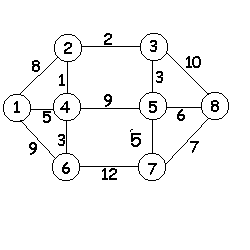

---
jupyter:
  jupytext:
    formats: ipynb,md
    text_representation:
      extension: .md
      format_name: markdown
      format_version: '1.3'
      jupytext_version: 1.17.0
  kernelspec:
    display_name: Python 3 (ipykernel)
    language: python
    name: python3
---

# Лабораторная работа 4.  Алгоритмы на графах

**Цель работы:** изучение некоторых алгоритмов на графах; исследование эффективности этих алгоритмов.

**Продолжительность работы:** - 4 часа. 

**Мягкий дедлайн (10 баллов)**: 29.04.2023 

**Жесткий дедлайн (5 баллов)**: 13.05.2023

## Теоретические сведения

Задача отыскания в графе (как ориентированном, так и неориентированном) кратчайшего пути имеет многочисленные практические приложения. 
С решением подобной задачи приходится встречаться в технике связи (например, при телефонизации населенных пунктов), на транспорте (при выборе оптимальных маршрутов доставки грузов), в микроэлектронике (при проектировании топологии микросхем) и т.д.

Путь между вершинами $i$ и $j$ графа считается кратчайшим, если вершины $i$ и $j$ соединены минимальным числом ребер (случай не взвешенного графа) или если сумма весов ребер, соединяющих вершины $i$ и $j$, минимальна (для взвешенного графа). 

В настоящее время известны десятки алгоритмов решения поставленной задачи.
Важным показателем алгоритма является его эффективность. Применительно к поставленной задаче эффективность алгоритма может зависеть в основном от двух параметров графа: число его вершин и число весов его ребер. В данной лабораторной работе для определения кратчайшего расстояния между вершинами графа исследуются два алгоритма: метод динамического программирования и метод Дейкстры.

### Метод динамического программирования

Метод рассматривает многостадийные процессы принятия решения. При постановке задачи динамического программирования формируется некоторый критерий. Процесс разбивается на стадии (шаги), в которых принимаются решения, приводящие к достижению общей поставленной цели. Таким образом,  метод динамического программирования  - метод пошаговой оптимизации.
Введем функцию $f_i$, определяющую минимальную длину пути из начальной  в вершину  $i$ . Обозначим через $S_{ij}$ длину пути между вершинами $i$ и $j$  , а  $f_j$ - наименьшую длину пути между вершиной $j$ и начальной вершиной.
Выбирая в качестве $i$ такую вершину, которая минимизирует сумму ($S_{i j} + f_j$) , получаем уравнение
$$
 f_i = \min (S_{i j} + f_j)
$$
Трудность решения данного уравнения заключается в том, что неизвестная функция входит в обе части равенства. В такой ситуации приходится прибегать к классическому методу последовательных приближений( итераций), используя  рекуррентную формулу:

$$
f_i^{(k+1)}  = \min (S_{i j} + f_j^{(k)}),
$$
где $f_j^{(k)}$  - $k$-е приближение функции.

Возможен другой подход к решению поставленной задачи с помощью метода стратегий. При движении из начальной точки $i$ в конечную $k$ получается приближение $f_i^{(0)} = S_{ik}$, где $S_{ik}$ - длина пути между точками $i$ и $k$.
Следующее приближение – поиск решения в классе двухзвенных ломаных. Дальнейшие приближения ищутся в классе трехзвенных, четырехзвенных и других ломаных.

#### Пример нахождения кратчайшего пути в ориентированном графе

Задание. Определить кратчайший путь из вершины 1 в вершину 10 для графа, представленного на рисунке: 

Начальные условия $f_1=0$, $S_{11} = 0$.

Находим последовательно значения функции $f_i$ (в условных единицах) для каждой вершины ориентированного графа:

$f_2 = \min(S_{21} + f_1) = 3 + f_1 = 3 + 0 = 3$;

$f_3 = \min(S_{31} + f_1) = 4 + f_1 = 4 + 0 = 4$;

$f_4 = \min(S_{41} + f_1) = 2 + f_1 = 2 + 0 = 2$;

$f_6 = \min 
\left(
  \begin{array}{c}
  S_{64} + f_4 \\
  S_{63} + f_3 \\
  S_{62} + f_2 \\
  \end{array}
\right) 
= 
\min 
\left(
  \begin{array}{c}
  2 + 2 \\
  6 + 4 \\
  3 + 3 \\
  \end{array}
\right) = 4$; 

$f_5 = \min 
\left(
  \begin{array}{c}
  S_{54} + f_4 \\
  S_{56} + f_6 \\
  \end{array}
\right)
= 
\min 
\left(
  \begin{array}{c}
  5 + 2 \\
  1 + 4 \\
  \end{array}
\right) = 5$; 

$f_7 = \min 
\left(
  \begin{array}{c}
  S_{75} + f_5 \\
  S_{76} + f_6 \\
  \end{array}
\right)
= 
\min 
\left(
  \begin{array}{c}
  6 + 5 \\
  8 + 4 \\
  \end{array}
\right) = 11$; 

$f_9 =  \min (S_{85} + f_5) = \min (12 + 5) = 17$;

$f_8 = \min 
\left(
  \begin{array}{c}
  S_{86} + f_6 \\
  S_{89} + f_9 \\
  \end{array}
\right)
= 
\min 
\left(
  \begin{array}{c}
  7 + 4 \\
  6 + 17 \\
  \end{array}
\right) = 11$; 

$f_{10} = \min 
\left(
  \begin{array}{c}
  S_{10, 7} + f_7 \\
  S_{10, 8} + f_8 \\
  S_{10, 9} + f_9 \\
  \end{array}
\right)
= 
\min 
\left(
  \begin{array}{c}
  4 + 11 \\
  3 + 11 \\
  11 + 17 \\
  \end{array}
\right) = 14$; 

Длина кратчайшего пути составляет 14 условных единиц. 

Для выбора оптимальной траектории движения следует осуществить просмотр функций $f_i$ в обратном порядке, то есть с $f_{10}$. 

Пусть $f_i = f_{10}$. 

В данном случае

$f_{10} = \min 
\left(
  \begin{array}{c}
  4 + f_7 \\
  3 + f_8 \\
  11 + f_9 \\
  \end{array}
\right)
= 
\min 
\left(
  \begin{array}{c}
  4 + 11 \\
  3 + 11 \\
  11 + 17 \\
  \end{array}
\right) = 14$; 

Получаем, что $3 + f_8 = 14$, то есть $f_j = f_8$. 
Значит, из вершины 10 следует перейти к вершине 8.

Имеем $f_i = f_8$.   

Рассмотрим функцию 
$f_8 = \min 
\left(
  \begin{array}{c}
  7 + f_6 \\
  6 + f_9 \\
  \end{array}
\right)
= 
\min 
\left(
  \begin{array}{c}
  7 + 4 \\
  6 + 17 \\
  \end{array}
\right) = 11,$

т.е. $f_j = f_6$ и т.д.

Таким образом, получаем кратчайший путь от вершины 1 к вершине 10: (1,  4,  6,  8,  10) 
	Рассмотренный метод определения кратчайшего пути может быть распространен и на неориентированные графы. 
    

#### Пример нахождения кратчайшего пути в неориентированном графе

Задание. Для графа из предыдущего примера  найти кратчайший путь от вершины 1 до вершины 10, рассматривая граф
как неориентированный. 

Матрица смежности весов графа в этом случае имеет вид:

|    | 1 | 2 | 3 | 4 | 5  | 6 | 7 | 8 | 9  | 10 |
|----|---|---|---|---|----|---|---|---|----|----|
| 1  | - | 3 | 4 | 2 | - | -  | - | - | -  | -  | 
| 2  | 3 | - | - | - | -  | 3 | - | - | -  | -  |
| 3  | 4 | - | - | - | -  | 6 | - | - | -  | -  |
| 4  | 2 | - | - | - | 5  | 2 | - | - | -  | -  |
| 5  | - | - | - | 5 | -  | 1 | 6 | - | 12 | -  |
| 6  | - | 3 | 6 | 2 | 1  | - | 8 | 7 | -  | -  |
| 7  | - | - | - | - | 6  | 8 | - | - | -  | 4  |
| 8  | - | - | - | - | -  | 7 | - | - | 6  | 3  |
| 9  | - | - | - | - | 12 | - | - | 6 | -  | 11 |
| 10 | - | - | - | - | -  | - | 4 | 3 | -  | -  |

$f_1 = 0$;

$f_2 = \min 
\left(
  \begin{array}{c}
  f_1 + 3 \\
  f_6 + 3 \\
  \end{array}
\right)$;

$f_3 = \min 
\left(
  \begin{array}{c}
  f_1 + 4 \\
  f_6 + 6 \\
  \end{array}
\right)$;

$f_4 = \min 
\left(
  \begin{array}{c}
  f_1 + 2 \\
  f_5 + 5 \\
  f_6 + 2 \\
  \end{array}
\right)$;

$f_5 = \min 
\left(
  \begin{array}{c}
  f_4 + 5 \\
  f_6 + 1 \\
  f_9 + 12 \\
  f_7 + 6 \\
  \end{array}
\right)$;

$f_6 = \min 
\left(
  \begin{array}{c}
  f_2 + 3 \\
  f_3 + 6 \\
  f_4 + 2 \\
  f_5 + 1 \\
  f_7 + 8 \\
  f_8 + 7 \\
  \end{array}
\right)$;

$f_7 = \min 
\left(
  \begin{array}{c}
  f_5 + 6 \\
  f_6 + 8 \\
  \end{array}
\right)$;

$f_8 = \min 
\left(
  \begin{array}{c}
  f_6 + 7 \\
  f_9 + 6 \\
  \end{array}
\right)$;

$f_9 = \min 
\left(
  \begin{array}{c}
  f_5 + 12 \\
  f_8 + 6 \\
  \end{array}
\right)$;

$f_{10} = \min 
\left(
  \begin{array}{c}
  f_7 + 4 \\
  f_8 + 3 \\
  f_9 + 11 \\
  \end{array}
\right)$;

Указанные целевые функции, представляют собой систему линейных алгебраических уравнений (в примере имеется 10 уравнений и 10 неизвестных).
Рассмотрим один из вариантов ее решения, учитывая, что $f_1 = 0$.

Тогда имеем:

$f_2 = 
\min 
\left(
  \begin{array}{c}
  f_1 + 3 \\
  f_6 + 3 \\
  \end{array}
\right)
=
\min 
\left(
  \begin{array}{c}
  0 + 3 \\
  f_6 + 3 \\
  \end{array}
\right) = 2$;

$f_3 
= \min 
\left(
  \begin{array}{c}
  f_1 + 4 \\
  f_6 + 6 \\
  \end{array}
\right)
= \min 
\left(
  \begin{array}{c}
  0 + 4 \\
  f_6 + 6 \\
  \end{array}
\right) = 4$;

$f_4 = \min 
\left(
  \begin{array}{c}
  f_1 + 2 \\
  f_5 + 5 \\
  f_6 + 2 \\
  \end{array}
\right)
= \min 
\left(
  \begin{array}{c}
  0 + 2 \\
  f_5 + 5 \\
  f_6 + 2 \\
  \end{array}
\right) = 2$;

$f_5 = \min 
\left(
  \begin{array}{c}
  f_4 + 5  \\
  f_6 + 1 \\
  f_9 + 12 \\
  f_7 + 6 \\
  \end{array}
\right) 
= \min 
\left(
  \begin{array}{c}
  2 + 5 \\
  f_6 + 1 \\
  \end{array}
\right)
= \min
\left(
  \begin{array}{c}
  7 \\
  f_6 + 1 \\
  \end{array}
\right)$;

$f_6 = \min 
\left(
  \begin{array}{c}
  f_2 + 3 \\
  f_3 + 6 \\
  f_4 + 2 \\
  f_5 + 1 \\
  f_7 + 8 \\
  f_8 + 7 \\
  \end{array}
\right)
= \min 
\left(
  \begin{array}{c}
  2 + 3 \\
  4 + 6 \\
  2 + 2 \\
  f_5 + 1 \\
  f_7 + 8 \\
  f_8 + 7 \\
  \end{array}
\right)
= \min 
\left(
  \begin{array}{c}
  5 \\
  10 \\
  4 \\
  f_5 + 1 \\
  f_7 + 8 \\
  f_8 + 7 \\
  \end{array}
\right)
= \min 
\left(
  \begin{array}{c}
  4 \\
  f_5 + 1 \\
  \end{array}
\right) = 4
$;

Подставив выражение для $f_6$ в $f_5$, получим

$
f_5 
= \min
\left(
  \begin{array}{c}
  7 \\
  4 + 1
  f_6 + 1 \\
  \end{array}
\right)
= \min
\left(
  \begin{array}{c}
  7 \\
  5 + 1 \\
  f_5 + 1 + 1 \\
  \end{array}
\right) = 5
$;

Тогда

$f_7 = \min 
\left(
  \begin{array}{c}
  f_5 + 6 \\
  f_6 + 8 \\
  \end{array}
\right)
= \min 
\left(
  \begin{array}{c}
  5 + 6 \\
  4 + 8 \\
  \end{array}
\right) = 11$;

$f_8 = \min 
\left(
  \begin{array}{c}
  f_6 + 7 \\
  f_9 + 6 \\
  \end{array}
\right)
 = \min 
\left(
  \begin{array}{c}
  4 + 7 \\
  f_9 + 6 \\
  \end{array}
\right)
 = \min 
\left(
  \begin{array}{c}
  11 \\
  f_9 + 6 \\
  \end{array}
\right)$;

$f_9 = \min 
\left(
  \begin{array}{c}
  f_5 + 12 \\
  f_8 + 6 \\
  \end{array}
\right)
= \min 
\left(
  \begin{array}{c}
  5 + 12 \\
  f_8 + 6 \\
  \end{array}
\right)
= \min 
\left(
  \begin{array}{c}
  17 \\
  f_8 + 6 \\
  \end{array}
\right)$;

$f_{10} = \min 
\left(
  \begin{array}{c}
  f_7 + 4 \\
  f_8 + 3 \\
  f_9 + 11 \\
  \end{array}
\right)
= \min 
\left(
  \begin{array}{c}
  11 + 4 \\
  f_8 + 3 \\
  f_9 + 11 \\
  \end{array}
\right)
= \min 
\left(
  \begin{array}{c}
  15 \\
  f_8 + 3 \\
  f_9 + 11 \\
  \end{array}
\right)$;

Подставляя $f_9$ в $f_8$, получаем

$f_8 
 = \min 
\left(
  \begin{array}{c}
  11 \\
  17 + 6
  f_8 + 6 \\
  \end{array}
\right) = 11$;

Окончательно имеем: 

$f_9 = \min 
\left(
  \begin{array}{c}
  17 \\
  f_8 + 6 \\
  \end{array}
\right)
= \min 
\left(
  \begin{array}{c}
  17 \\
  11 + 6 \\
  \end{array}
\right)
= 17$; 

$f_{10} = \min 
\left(
  \begin{array}{c}
  15 \\
  f_8 + 3 \\
  f_9 + 11 \\
  \end{array}
\right) 
= \min 
\left(
  \begin{array}{c}
  15 \\
  11 + 3 \\
  17 + 11 \\
  \end{array}
\right) = 14$.

###  Алгоритм Дейкстры

https://ru.wikipedia.org/wiki/Алгоритм_Дейкстры

Алгоритм Дейкстры предназначен для нахождения кратчайшего пути между вершинами в неориентированном графе. Идея алгоритма следующая, сначала выберем путь до начальной вершины равным нулю, и заносим эту вершину во множество уже выбранных, расстояние  от  которых  до оставшихся невыбранных вершин определено. На каждом следующем этапе  находим следующую невыбранную вершину, расстояние до которой наименьшее и соединённую ребром с какой-нибудь вершиной из множества выбранных (это расстояние будет равно расстоянию до уже выбранной  вершины плюс длина ребра).

###  Алгоритм Флойда—Уоршелла

https://ru.wikipedia.org/wiki/Алгоритм_Флойда_—_Уоршелла

Алгоритм Флойда—Уоршелла () - алгоритм  поиска кратчайших путей во взвешенном графе с положительным или отрицательным весом ребер (но без отрицательных циклов). За одно выполнение алгоритма будут найдены длины (суммарные веса) кратчайших путей между всеми парами вершин. 

###  Алгоритм Йена

https://en.wikipedia.org/wiki/Yen%27s_algorithm

Алгоритм Йена вычисляет K-кратчайших путей без циклов из одной вершины графа с неотрицательными весами ребер. 

###  Алгоритм Беллмана- Форда

https://en.wikipedia.org/wiki/Алгоритм_Беллмана_—_Форда

Алгоритм Беллмана — Форда — алгоритм поиска кратчайшего пути во взвешенном графе.

## Варианты заданий

Задание 1: Найти кратчайший путь на графе между парами вершин методом динамического программирования вручную.

| Вариант | Начальная и конечная вершины| Граф |
|:---|:---|:---|
| 1  | 1, 6 |  |
| 2  | 1, 6 |  |
| 3  | 2, 6 |  |
| 4  | 1, 7 |  |
| 5  | 2, 6 |  |
| 6  | 1, 6 |  |
| 7  | 1, 6 |  |
| 8  | 5, 7 |  |
| 9  | 1, 7 |  |
| 10 | 1, 6 |  |
| 11 | 4, 7 |  |
| 12 | 1, 7 |  |
| 13 | 3, 7 |  |
| 14 | 3, 7 |  |
| 15 | 1, 7 |  |
| 16 | 2, 7 |  |
| 17 | 2, 5 |  |
| 18 | 1, 6 |  |
| 19 | 1, 3 |  |
| 20 | 2, 5 |  |

Задание 2: Реализовать прогрммно поиск кратчайшего пути на графе между парами вершин из задания 1 методом динамического программирования.

Задание 3. Реализовать алгоритм Дейкстры поиска кратчайшего пути на графе между парами вершин:

| Вариант | Начальная и конечная вершины| Граф | 
|:---|:---|:---|
| 1  | 3, 6 |  |
| 2  | 2, 8 |  |
| 3  | 1, 5 |  |
| 4  | 3, 8 |  |
| 5  | 1, 6 |  |
| 6  | 3, 8 |  |
| 7  | 8, 2 |  |
| 8  | 7, 3 |  |
| 9  | 2, 7 |  |
| 10 | 5, 8 |  |
| 11 | 3, 7 |  |
| 12 | 8, 2 |  |
| 13 | 1, 4 |  |
| 14 | 5, 7 |  |
| 15 | 1, 6 |  |
| 16 | 2, 7 |  |
| 17 | 3, 8 |  |
| 18 | 1, 6 |  |
| 19 | 6, 2 |  |
| 20 | 2, 5 |  |

Задание 4: Реализовать прогрммно один из алгоритмов поиска кратчайшего пути на графе между парами вершин из задания 3.

## Литература

1. Т. Кормен, Ч. Лейзерсон, Р. Ривест Алгоритмы: построение и анализ. М.: МЦНМО, 2000.

2. Д.Кнут Искусство программирования , том 1. Основные алгоритмы. Уч . пос. М.:Изд. Дом " Вильямс ", 2000.

3. Вирт Н. Алгоритмы и структуры данных.: Пер. С англ. - М.: Мир, 2001.

4. Хусаинов Б.С. Структуры и алгоритмы обработки данных. Примеры на языке Си. Учеб. пособие. М : Финансы и статистика, 2004.

5. А. Ахо, Дж.Хопкрофт, Дж.Ульман, Структуры данных и алгоритмы М: СПб: Киев: Вильямс,
 