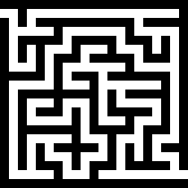

---
jupyter:
  jupytext:
    formats: ipynb,md
    text_representation:
      extension: .md
      format_name: markdown
      format_version: '1.3'
      jupytext_version: 1.17.0
  kernelspec:
    display_name: Python 3 (ipykernel)
    language: python
    name: python3
---

# Лабораторная работа 5.  Эвристические алгоритмы

**Цель работы:** ознакомление с  эвристическими алгоритмами  и методикой оценки  их эффективности.

**Продолжительность работы:** - 4 часа. 

**Мягкий дедлайн (10 баллов)**: 20.05.2023 

**Жесткий дедлайн (5 баллов)**: 02.06.2023

## Варианты заданий

## Задание 1.

Дан либиринт. Вход в лабиринт находится сверху слева, выход - снизу справа.  

| Вариант | Лабиринт | 
|:---|:---|
|  1  |  |
|  2  |  |
|  3  |  |
|  4  |  |
|  5  |  |
|  6  |  |
|  7  |  |
|  8  |  |
|  9  |  |
| 10  |  |
| 11  |  |
| 12  |  |
| 13  |  |
| 14  |  |
| 15  |  |
| 16  |  |
| 17  |  |
| 18  |  |
| 19  |  |
| 20  |  |

а) Используя волновой алгоритм вручную построить оптимальный путь через лабиринт.

б) Используя маршрутный алгоритм вручную построить оптимальный путь через лабиринт.

## Задание 2.

Дан либиринт. Вход в лабиринт находится сверху слева, выход - снизу справа. 
Реализовав алгоритм в соответствии с заданием построить оптимальный путь через лабиринт.

| Вариант | Лабиринт | Алгоритм |
|:---|:---|:---|
|  1  |  | Марштутный алгоритм с евклидовым расстоянием |
|  2  |  | Волновой алгоритм |
|  3  |  | Двухлучевой алгоритм |
|  4  |  | Марштутный алгоритм с евклидовым расстоянием |
|  5  |  | Двухлучевой алгоритм |
|  6  |  | Волновой алгоритм |
|  7  |  | Двухлучевой алгоритм |
|  8  |  | Марштутный алгоритм с манхэттенским расстоянием |
|  9  |  | Двухлучевой алгоритм |
| 10  |  | Марштутный алгоритм с евклидовым расстоянием |
| 11  |  | Марштутный алгоритм с манхэттенским расстоянием |
| 12  |  | Волновой алгоритм |
| 13  |  | Двухлучевой алгоритм |
| 14  |  | Марштутный алгоритм с манхэттенским расстоянием |
| 15  |  | Марштутный алгоритм с евклидовым расстоянием |
| 16  |  | Двухлучевой алгоритм |
| 17  |  | Волновой алгоритм |
| 18  |  | Марштутный алгоритм с манхэттенским расстоянием |
| 19  |  | Двухлучевой алгоритм |
| 20  |  | Волновой алгоритм |

Евклидово расстояние: $d = \sqrt{(x_2 - x_1)^2 + (y_2 - y_1)^2 }$ (Двигаться можно по ветрикали, горизонтали и диагонали)

Манхэттенское расстояние:  $d = |x_2 - x_1| + |y_2 - y_1| $ (Двигаться можно только по горизонтали и вертикали)

## Формат решения:

Исходный лабиринт:
    

Формат решения

|<!-- -->|<!-- --> |<!-- --> |<!-- --> |<!-- --> |<!-- --> |<!-- --> |<!-- --> |<!-- --> |<!-- --> |
|:------:|:-------:|:-------:|:-------:|:-------:|:-------:|:-------:|:-------:|:-------:|:-------:|
|9       |&#9632;  |&#9632;  |&#9632;  |&#9632;  |&#9632;  |&#9632;  |&#9632;  |&#9632;  |&#9632;  |
|8       |&#9633;  |&#9633;  |&#9633;  |&#9633;  |&#9632;  |&#9633;  |&#9633;  |&#9633;  |&#9632;  |
|7       |&#9632;  |&#9633;  |&#9632;  |&#9633;  |&#9632;  |&#9633;  |&#9632;  |&#9633;  |&#9632;  |
|6       |&#9632;  |&#9633;  |&#9632;  |&#9633;  |&#9633;  |&#9633;  |&#9632;  |&#9633;  |&#9632;  |
|5       |&#9632;  |&#9633;  |&#9632;  |&#9632;  |&#9632;  |&#9632;  |&#9632;  |&#9633;  |&#9632;  |
|4       |&#9632;  |&#9633;  |&#9632;  |&#9633;  |&#9632;  |&#9633;  |&#9633;  |&#9633;  |&#9632;  |
|3       |&#9632;  |&#9633;  |&#9632;  |&#9633;  |&#9632;  |&#9633;  |&#9632;  |&#9632;  |&#9632;  |
|2       |&#9632;  |&#9633;  |&#9633;  |&#9633;  |&#9632;  |&#9633;  |&#9633;  |&#9633;  |&#9633;  |
|1       |&#9632;  |&#9632;  |&#9632;  |&#9632;  |&#9632;  |&#9632;  |&#9632;  |&#9632;  |&#9632;  |
|<!-- -->|1        |2        |3        |4        |5        |6        |7        |8        |9        |

|<!-- -->|<!-- --> |<!-- --> |<!-- --> |<!-- --> |<!-- --> |<!-- --> |<!-- --> |<!-- --> |<!-- --> |
|:------:|:-------:|:-------:|:-------:|:-------:|:-------:|:-------:|:-------:|:-------:|:-------:|
|9       |&#9632;  |&#9632;  |&#9632;  |&#9632;  |&#9632;  |&#9632;  |&#9632;  |&#9632;  |&#9632;  |
|8       |&#128997;|&#128997;|&#128997;|&#128997;|&#9632;  |&#128997;|&#128997;|&#128997;|&#9632;  |
|7       |&#9632;  |&#9633;  |&#9632;  |&#128997;|&#9632;  |&#128997;|&#9632;  |&#128997;|&#9632;  |
|6       |&#9632;  |&#9633;  |&#9632;  |&#128997;|&#128997;|&#128997;|&#9632;  |&#128997;|&#9632;  |
|5       |&#9632;  |&#9633;  |&#9632;  |&#9632;  |&#9632;  |&#9632;  |&#9632;  |&#128997;|&#9632;  |
|4       |&#9632;  |&#9633;  |&#9632;  |&#9633;  |&#9632;  |&#128997;|&#128997;|&#128997;|&#9632;  |
|3       |&#9632;  |&#9633;  |&#9632;  |&#9633;  |&#9632;  |&#128997;|&#9632;  |&#9632;  |&#9632;  |
|2       |&#9632;  |&#9633;  |&#9633;  |&#9633;  |&#9632;  |&#128997;|&#128997;|&#128997;|&#128997;|
|1       |&#9632;  |&#9632;  |&#9632;  |&#9632;  |&#9632;  |&#9632;  |&#9632;  |&#9632;  |&#9632;  |
|<!-- -->|1        |2        |3        |4        |5        |6        |7        |8        |9        |

## Литература

Дональд Э. Кнут. Искусство программирования, том 2. Получисленные алгоритмы = The Art of Computer Programming, vol.2. Seminumerical Algorithms, 3-ed. — Вильямс, 2007. — С. 832. — ISBN 978-5-8459-0081-4.

Роберт Седжвик. Фундаментальные алгоритмы на C. Анализ/Структуры данных/Сортировка/Поиск = Algorithms in C. Fundamentals/Data Structures/Sorting/Searching. — СПб.: ДиаСофтЮП, 2003. — С. 672. — ISBN 5-93772-081-4.
